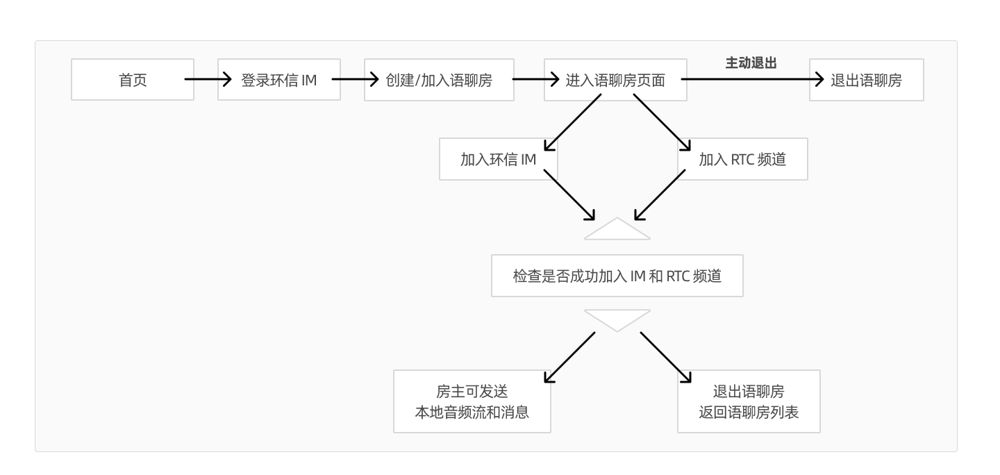
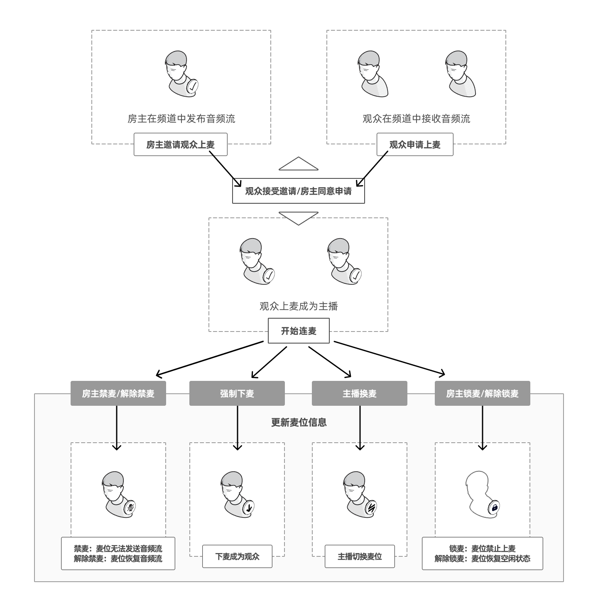
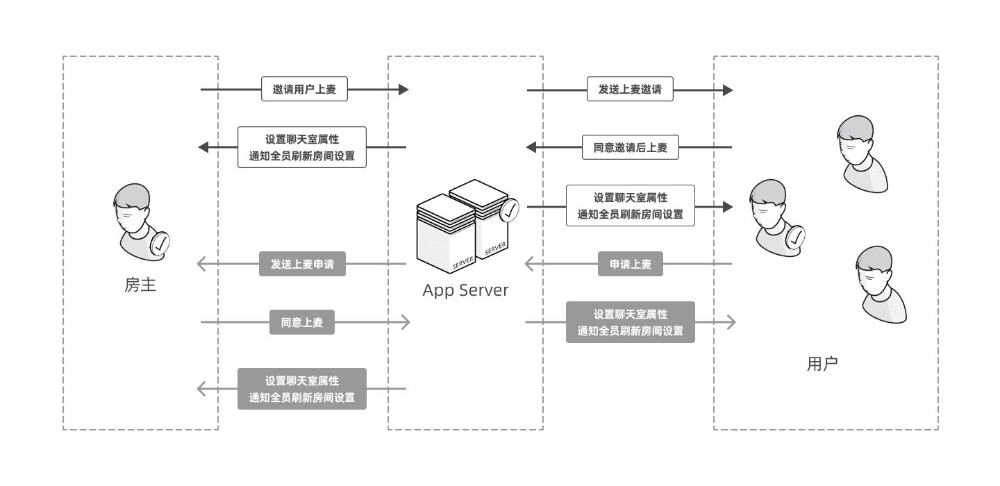
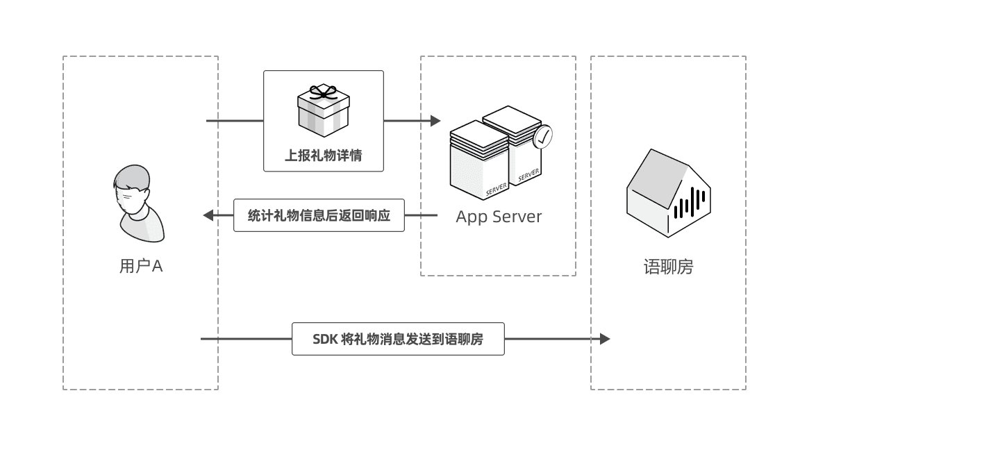

# voiceroom_demo_ios
# 客户端实现

## 场景描述

本文介绍如何通过环信 IM SDK 和 Agora Audio SDK 在你的 iOS 项目里实现语聊房的主要功能。

## 技术原理

### 房间管理

语聊房 SDK 内部依赖环信 IM 聊天室（Chatroom）与 Agora Audio 的音频房间（RTC Channel）。

语聊房内用户角色说明如下：

| 角色             | 描述                                                         |
| :----------| :----------------------------------------------------------- |
| 房主     | 语聊房创建者，在 Demo 中占用 0 号麦位，不可修改。房主可以接收、发送音频流。                                     |
| 主播 | 进入语聊房后，通过上麦成为主播，可以接收、发送音频流。 |
| 观众   | 进入语聊房后，接收音频流。申请上麦或房主邀请上麦后，可以和主播实时互动。   |

以下为房间管理流程图。



房间管理流程如下：
1. 用户利用手机号和验证码登录环信 IM。
2. 房主可创建语聊房，普通用户加入语聊房。 
3. 加入环信 IM 和 RTC 频道。
4. 进入语聊房，检查是否成功加入环信 IM 和 RTC 频道。
   - 若成功加入，房主可以发送本地音频流和消息，观众可以发消息。
   - 若未成功加入，退出房间，返回房间列表页面。
5. 退出房间。

房间相关操作如下表所示：

| 操作          | 描述                                                     |
| :------------- | :----------------------------------------------------------- |
| 创建房间  | 房主通过 App Server 创建语聊房，创建成功后自动加入语聊房。房主自动上麦成为主播，更新房间内麦位信息。<br/> 加入语聊房前，调用 `VoiceRoomIMManager.configIM` 方法初始化环信 IM，调用 `ASRTCKit.getSharedInstance` 方法初始化 Agora Audio。            |
| 加入房间  | 用户可调用 `joinRoom` 方法加入语聊房。加入语聊房前，调用 `VoiceRoomIMManager.loginIM` 方法登录环信 IM，然后调用 `VoiceRoomIMManager.joinChatRoom` 和 `self.rtcKit.joinChannel` 方法加入聊天室和 RTC 频道，成功后再加入语聊房。                    |
| 离开房间  | 观众或主播可调用 `leaveRoom()` 方法离开语聊房。房主离开语聊房，语聊房对象自动销毁，其他成员自动离开语聊房。  |
| 发送音频流  | 观众或主播可调用 `self.rtcKit.joinChannel` 方法发送音频流。                        |
| 发送消息  | 语聊房内的用户可调用 `VoiceRoomIMManager.sendMessage` 或者 `VoiceRoomIMManager.sendCustomMessage` 方法发送消息。观众也可以调用 `VoiceRoomIMManager.sendGift` 方法发送礼物消息。                    |

### 麦位管理 

以下为麦位管理流程图：



麦位相关操作如下所示：

| 操作          | 描述                                                     |
| :------------- | :----------------------------------------------------------- |
| 邀请上麦 | 房主调用 `inviteUserToMic` RESTful API 邀请观众上麦。观众收到 `receiveInviteSite` 回调，选择是否同意上麦。<br/> - 观众调用 `agreeInvite` RESTful API 同意上麦，成为主播，App Server 设置聊天室属性。同时，房间内所有用户会收到该观众连麦的回调 `VoiceRoomIMDelegate.chatroomAttributesDidUpdate`，并更新房间内麦位信息。  |
| 申请上麦 | 观众调用 `requestSpeak` 方法向房主申请上麦。房主收到 `VoiceRoomIMManager.receiveApplySite` 回调，选择同意或拒绝申请。<br> - 房主调用 `agreeUserApply` 方法同意上麦申请，申请者收到 `VoiceRoomIMDelegate.chatroomAttributesDidUpdate` 回调并调用 `self.rtcKit.joinChannel` 方法成为主播。同时，房间内所有用户会收到该观众连麦的回调 `VoiceRoomIMDelegate.chatroomAttributesDidUpdate`，并更新房间内麦位信息。<br> - 房主调用 `refuseApply` RESTful API 方法拒绝上麦申请。  |
| 下麦 | 1. 主动下麦： 主播可调用 leaveMic 方法下麦成为观众。房间内所有用户会收到该连麦主播的下麦信息并更新房间内麦位信息。<br/> 2. 被踢下麦：房主调用 `kickOff` RESTful API 对主播发起下麦指令。该连麦主播收到 `VoiceRoomIMDelegate.chatroomAttributesDidUpdate` 回调，然后下麦成为观众。房间内所有用户会收到该连麦主播的下麦信息并更新房间内麦位信息。|
| 禁麦  | 房主调用 `muteMic` RESTful API 禁麦，不允许指定连麦主播发言。该连麦主播收到 `VoiceRoomIMDelegate.chatroomAttributesDidUpdate` 回调，房间内所有用户会收到该连麦主播的禁麦信息并更新房间内麦位信息。  |
| 解禁麦位  | 房主调用 `unmuteMic` RESTful API 解禁麦位，恢复连麦主播的发言权限。该连麦主播收到 `VoiceRoomIMDelegate.chatroomAttributesDidUpdate` 回调，房间内所有用户会收到该连麦主播的解禁信息并更新房间内麦位信息。 |
| 锁麦  | 房主调用 `lockMic` RESTful API 锁麦，不允许任何人上该麦位。锁麦时，若该麦位有主播连麦，该主播收到 `VoiceRoomIMDelegate.chatroomAttributesDidUpdate` 回调，被踢下来成为普通观众，房间内所有用户会收到锁麦信息并更新房间内麦位信息。  |
| 解锁麦位  | 房主调用 `unlockMic` RESTful API 解锁麦位，使指定麦位恢复空闲状态，观众可以在该麦位申请上麦。房间内所有用户会收到麦位解封信息并更新房间内麦位信息。 |
| 跳麦  | 主播可调用 `changeMic` 方法换麦，即从当前麦位切换到另一个空闲麦位。 |
 
### 发送单向消息流程图



邀请用户上麦的流程如下：
1. 房主调用 RESTFul API 邀请用户上麦。
2. App Server 收到邀请消息后，利用房主角色向用户发送该消息。
3. 用户同意邀请后调用 RESTful API 上麦。
4. App Server 设置聊天室属性通知房间全员刷新房间设置。

用户申请上麦的流程如下：
1. 用户调用 RESTful 接口申请上麦。
2. App Server 收到上麦申请消息后以用户角色向房主发送该消息。
3. 房主收到上麦申请后调用 RESTful API 同意上麦。
4. App Server 设置聊天室属性通知房间全员刷新房间设置。

### 发送礼物消息流程图



发送礼物消息的流程如下：
1. 用户 A 发送礼物消息到 App Server。
2. App Server 统计礼物消息后对用户 A 返回响应。
3. SDK 将礼物消息发送到语聊房。

## 前提条件

- Xcode 13.0 或以上版本。
- Cocoapods。你可以参考 [Getting Started with CocoaPods](https://guides.cocoapods.org/using/getting-started.html#getting-started) 安装。
- iOS 13.0 或以上版本的设备。部分模拟机可能无法支持本项目的全部功能，所以推荐使用真机。
- 有效的环信 IM 开发者账号和 App key，详见[环信即时通讯云控制台](https://console.easemob.com/user/login)。
- [有效的 Agora 项目，获取项目的 App ID 以及一个 RTC Token，实现语音通话。](https://docs.agora.io/cn/voice-call-4.x/start_call_audio_ios_ng?platform=iOS)。
- 如果你的网络环境部署了防火墙，请联系环信技术支持设置白名单。

## 项目配置

| 产品      | SDK 下载   | 集成文档      |
| :-------- | :----- | :-------- |
| 环信即时通讯 IM SDK | 环信即时通讯 IM SDK 大于等于 3.9.8 | [发送和接收消息](http://docs-im-beta.easemob.com/document/ios/message_send_receive.html) |
| Agora Audio SDK | 声网 RTM SDK 4.0.1 | [实现音频通话](https://docs.agora.io/cn/voice-call-4.x/start_call_audio_ios_ng?platform=iOS)  |

## 基本 API 参考

下表提供环信 IM SDK 和 Agora Audio SDK 的基本 API 参考。

[Server Api文档，静态HTML需下载后查看](https://github.com/easemob/voiceroom_demo_ios/blob/dev/redoc-static.html.zip)

[Demo对照Server Api枚举实现](https://github.com/easemob/voiceroom_demo_ios/blob/dev/EasemobVoice_iOS/EasemobVoice_iOS/Common/Network/VoiceRoomBusinessApi.swift)

### 房间管理 API 如下表所示：

|  API              | 实现功能                |
| :-------- | :-------- | 
| [VoiceRoomBusinessApi.fetchRoomInfo](https://github.com/easemob/voiceroom_demo_ios/blob/dev/EasemobVoice_iOS/EasemobVoice_iOS/Common/Network/VoiceRoomBusinessApi.swift)      | 获取指定语聊房的信息。 |
| [VoiceRoomBusinessApi.createRoom](https://github.com/easemob/voiceroom_demo_ios/blob/dev/EasemobVoice_iOS/EasemobVoice_iOS/Common/Network/VoiceRoomBusinessApi.swift)          | 创建房间。   |
| [VoiceRoomBusinessApi.deleteRoom](https://github.com/easemob/voiceroom_demo_ios/blob/dev/EasemobVoice_iOS/EasemobVoice_iOS/Common/Network/VoiceRoomBusinessApi.swift)         | 根据 ID 删除房间。|
| [VoiceRoomBusinessApi.modifyRoomInfo](https://github.com/easemob/voiceroom_demo_ios/blob/dev/EasemobVoice_iOS/EasemobVoice_iOS/Common/Network/VoiceRoomBusinessApi.swift)      | 修改语聊房信息。|
| [VoiceRoomBusinessApi.fetchRoomList](https://github.com/easemob/voiceroom_demo_ios/blob/dev/EasemobVoice_iOS/EasemobVoice_iOS/Common/Network/VoiceRoomBusinessApi.swift)       | 获取房间列表。|
| [VoiceRoomBusinessApi.fetchRoomMembers](https://github.com/easemob/voiceroom_demo_ios/blob/dev/EasemobVoice_iOS/EasemobVoice_iOS/Common/Network/VoiceRoomBusinessApi.swift)   | 获取房间内的成员。|
| [VoiceRoomBusinessApi.joinRoom](https://github.com/easemob/voiceroom_demo_ios/blob/dev/EasemobVoice_iOS/EasemobVoice_iOS/Common/Network/VoiceRoomBusinessApi.swift)           | 加入房间。|
| [VoiceRoomBusinessApi.validatePassWord](https://github.com/easemob/voiceroom_demo_ios/blob/dev/EasemobVoice_iOS/EasemobVoice_iOS/Common/Network/VoiceRoomBusinessApi.swift)   | 校验密码。|
| [VoiceRoomBusinessApi.leaveRoom](https://github.com/easemob/voiceroom_demo_ios/blob/dev/EasemobVoice_iOS/EasemobVoice_iOS/Common/Network/VoiceRoomBusinessApi.swift)          | 离开房间。|
| [VoiceRoomBusinessApi.kickUser](https://github.com/easemob/voiceroom_demo_ios/blob/dev/EasemobVoice_iOS/EasemobVoice_iOS/Common/Network/VoiceRoomBusinessApi.swift)           | 踢出房间。|

### 麦位管理 API 如下表所示：

|  API               | 实现功能                  |
| :-------- | :-------- | 
| [VoiceRoomBusinessApi.fetchMicsInfo](https://github.com/easemob/voiceroom_demo_ios/blob/dev/EasemobVoice_iOS/EasemobVoice_iOS/Common/Network/VoiceRoomBusinessApi.swift)           | 获取麦位信息。|
| [VoiceRoomBusinessApi.fetchApplyMembers](https://github.com/easemob/voiceroom_demo_ios/blob/dev/EasemobVoice_iOS/EasemobVoice_iOS/Common/Network/VoiceRoomBusinessApi.swift)      | 获取上麦申请列表。|
| [VoiceRoomBusinessApi.inviteUserToMic](https://github.com/easemob/voiceroom_demo_ios/blob/dev/EasemobVoice_iOS/EasemobVoice_iOS/Common/Network/VoiceRoomBusinessApi.swift)        | 邀请上麦。|
| [VoiceRoomBusinessApi.agreeInvite](https://github.com/easemob/voiceroom_demo_ios/blob/dev/EasemobVoice_iOS/EasemobVoice_iOS/Common/Network/VoiceRoomBusinessApi.swift)            | 用户同意上麦邀请。|
| [VoiceRoomBusinessApi.refuseInvite](https://github.com/easemob/voiceroom_demo_ios/blob/dev/EasemobVoice_iOS/EasemobVoice_iOS/Common/Network/VoiceRoomBusinessApi.swift)           | 用户拒绝上麦邀请。|
| [VoiceRoomBusinessApi.submitApply](https://github.com/easemob/voiceroom_demo_ios/blob/dev/EasemobVoice_iOS/EasemobVoice_iOS/Common/Network/VoiceRoomBusinessApi.swift)            | 提交上麦申请。|
| [VoiceRoomBusinessApi.cancelApply](https://github.com/easemob/voiceroom_demo_ios/blob/dev/EasemobVoice_iOS/EasemobVoice_iOS/Common/Network/VoiceRoomBusinessApi.swift)            | 撤销上麦申请。|
| [VoiceRoomBusinessApi.refuseApply](https://github.com/easemob/voiceroom_demo_ios/blob/dev/EasemobVoice_iOS/EasemobVoice_iOS/Common/Network/VoiceRoomBusinessApi.swift)            | 拒绝上麦申请。|
| [VoiceRoomBusinessApi.agreeApply](https://github.com/easemob/voiceroom_demo_ios/blob/dev/EasemobVoice_iOS/EasemobVoice_iOS/Common/Network/VoiceRoomBusinessApi.swift)             | 同意上麦申请。|
| [VoiceRoomBusinessApi.closeMic](https://github.com/easemob/voiceroom_demo_ios/blob/dev/EasemobVoice_iOS/EasemobVoice_iOS/Common/Network/VoiceRoomBusinessApi.swift)                | 关麦。|    
| [VoiceRoomBusinessApi.cancelCloseMic](https://github.com/easemob/voiceroom_demo_ios/blob/dev/EasemobVoice_iOS/EasemobVoice_iOS/Common/Network/VoiceRoomBusinessApi.swift)         | 开麦。|
| [VoiceRoomBusinessApi.leaveMic](https://github.com/easemob/voiceroom_demo_ios/blob/dev/EasemobVoice_iOS/EasemobVoice_iOS/Common/Network/VoiceRoomBusinessApi.swift)               | 主动下麦。|
| [VoiceRoomBusinessApi.muteMic](https://github.com/easemob/voiceroom_demo_ios/blob/dev/EasemobVoice_iOS/EasemobVoice_iOS/Common/Network/VoiceRoomBusinessApi.swift)                 | 封禁指定麦位。|
| [VoiceRoomBusinessApi.unmuteMic](https://github.com/easemob/voiceroom_demo_ios/blob/dev/EasemobVoice_iOS/EasemobVoice_iOS/Common/Network/VoiceRoomBusinessApi.swift)              | 解禁指定麦位。|
| [VoiceRoomBusinessApi.exchangeMic](https://github.com/easemob/voiceroom_demo_ios/blob/dev/EasemobVoice_iOS/EasemobVoice_iOS/Common/Network/VoiceRoomBusinessApi.swift)            | 换麦。|
| [VoiceRoomBusinessApi.kickMic](https://github.com/easemob/voiceroom_demo_ios/blob/dev/EasemobVoice_iOS/EasemobVoice_iOS/Common/Network/VoiceRoomBusinessApi.swift)                 | 踢用户下麦。|
| [VoiceRoomBusinessApi.lockMic](https://github.com/easemob/voiceroom_demo_ios/blob/dev/EasemobVoice_iOS/EasemobVoice_iOS/Common/Network/VoiceRoomBusinessApi.swift)                | 锁定麦位。|
| [VoiceRoomBusinessApi.unlockMic](https://github.com/easemob/voiceroom_demo_ios/blob/dev/EasemobVoice_iOS/EasemobVoice_iOS/Common/Network/VoiceRoomBusinessApi.swift)              | 解锁麦位。|

### 礼物榜单 API 如下表所示：

|   API              | 实现功能                |
| :-------- | :-------- | 
| [VoiceRoomBusinessApi.fetchGiftContribute](https://github.com/easemob/voiceroom_demo_ios/blob/dev/EasemobVoice_iOS/EasemobVoice_iOS/Common/Network/VoiceRoomBusinessApi.swift)   | 获取赠送礼物榜单。|
| [VoiceRoomBusinessApi.giftTo](https://github.com/easemob/voiceroom_demo_ios/blob/dev/EasemobVoice_iOS/EasemobVoice_iOS/Common/Network/VoiceRoomBusinessApi.swift)                | 赠送礼物。|


### VoiceRoomIMManager.swift(对HyphenateChat IMSDK进行封装) API 如下表所示：

|   API              | 实现功能                |
| :-------- | :-------- | 
| [VoiceRoomIMManager.configIM](https://github.com/easemob/voiceroom_demo_ios/blob/dev/EasemobVoice_iOS/EasemobVoice_iOS/Common/Network/VoiceRoomIMManager.swift)   | 初始化IM。|
| [VoiceRoomIMManager.loginIM](https://github.com/easemob/voiceroom_demo_ios/blob/dev/EasemobVoice_iOS/EasemobVoice_iOS/Common/Network/VoiceRoomIMManager.swift)                | 登录IM。|
| [VoiceRoomIMManager.addChatRoomListener](https://github.com/easemob/voiceroom_demo_ios/blob/dev/EasemobVoice_iOS/EasemobVoice_iOS/Common/Network/VoiceRoomIMManager.swift)   | 添加IM消息以及聊天室回调监听。|
| [VoiceRoomIMManager.removeListener](https://github.com/easemob/voiceroom_demo_ios/blob/dev/EasemobVoice_iOS/EasemobVoice_iOS/Common/Network/VoiceRoomIMManager.swift)                | 移除IM消息以及聊天室回调监听。|

### Agora_audio iOS sdk api封装回调

|   API              | 实现功能                |
| :-------- | :-------- | 
| [AgoraRtcEngineKit.sharedEngine(withAppId: AgoraConfig.rtcId, delegate: nil)](https://github.com/easemob/voiceroom_demo_ios/blob/dev/EasemobVoice_iOS/EasemobVoice_iOS/Compoment/AgoraRtcKit/ASRTCKit.swift)   | 初始化RTC。|
| [ASRTCKit.joinVoicRoomWith](https://github.com/easemob/voiceroom_demo_ios/blob/dev/EasemobVoice_iOS/EasemobVoice_iOS/Compoment/AgoraRtcKit/ASRTCKit.swift)                | 加入RTC channel。|
| [ASRTCKit.setClientRole](https://github.com/easemob/voiceroom_demo_ios/blob/dev/EasemobVoice_iOS/EasemobVoice_iOS/Compoment/AgoraRtcKit/ASRTCKit.swift)   | 设置RTC角色。|
| [ASRTCKit.leaveChannel](https://github.com/easemob/voiceroom_demo_ios/blob/dev/EasemobVoice_iOS/EasemobVoice_iOS/Compoment/AgoraRtcKit/ASRTCKit.swift)         | 离开RTC channel。|

### 初始设置

加入语聊房前，进行[环信 IM SDK 初始化](http://docs-im-beta.easemob.com/document/android/quickstart.html#%E5%AE%9E%E7%8E%B0%E5%8D%95%E8%81%8A)和
[Agora Audio 初始化](https://docs.agora.io/cn/voice-call-4.x/start_call_audio_ios_ng?platform=iOS#%E5%AE%9E%E7%8E%B0%E8%AF%AD%E9%9F%B3%E9%80%9A%E8%AF%9D%E9%80%BB%E8%BE%91)设置。

### 加入/离开环信 IM 聊天室或者声网 RTC 频道

| API         | 实现功能                |
| :--------- | :------------ |
|  [joinChatroom](http://sdkdocs.easemob.com/apidoc/ios/chat3.0/protocol_i_e_m_chatroom_manager-p.html#ac66d04fd0182c7499ed539c0ea610152)       | 加入语聊房。房间内的观众会收到 `userDidJoinChatroom` 回调。用户加入语聊房后才能接收或发布音频流。               |
|  [leaveChatroom](http://sdkdocs.easemob.com/apidoc/ios/chat3.0/protocol_i_e_m_chatroom_manager-p.html#ac66d04fd0182c7499ed539c0ea610152)      | 离开语聊房。其他成员收到 userDidLeaveChatroom 回调。房主离开语聊房后，房间对象自动销毁，其他成员会自动离开语聊房。                |
|  [joinChannelbyToken](https://docs.agora.io/cn/voice-call-4.x/API%20Reference/ios_ng/API/class_irtcengine.html#api_irtcengine_joinchannel)       | 加入 RTC 频道。用户加入语聊房后才能接收或发布音频流。房间内的观众会收到 ASManagerDelegate.didRtcLocalUserJoinedOfUid 回调                 |
|  [leaveChannel](https://docs.agora.io/cn/voice-call-4.x/API%20Reference/ios_ng/API/class_irtcengine.html#api_irtcengine_leavechannel)| 离开 RTC 频道。 |

1.加入和离开 RTC 频道的链接是否正确？

通过 App Server 加入或离开语聊房的方法的示例代码如下：

``` Swift
// 加入语聊房
    func uploadStatus( status: Bool) {
        guard let roomId = self.roomInfo?.room?.room_id  else { return }
        VoiceRoomBusinessRequest.shared.sendPOSTRequest(api: .joinRoom(roomId: roomId), params: [:]) { dic, error in
            if let result = dic?["result"] as? Bool,error == nil,result {
                self.view.makeToast("Joined successful!".localized(),point: self.toastPoint, title: nil, image: nil, completion: nil)
            } else {
                self.didHeaderAction(with: .back,destroyed: false)
            }
        }
    }
// 离开语聊房
    @objc private func leaveRoom() {
        if let room_id = roomInfo?.room?.room_id {
            VoiceRoomBusinessRequest.shared.sendDELETERequest(api: .leaveRoom(roomId: room_id), params: [:]) { map, err in
                print(map?["result"] as? Bool ?? false)
            }
        }
    }
```

环信 IM 相关回调以及处理请在 `VoiceRoomViewController+IM` 文件中查看相关方法。

送礼物及其底部时间回调请在 `VoiceRoomViewController+ChatBar` 文件中查看相关方法。

### 麦位相关

请在 `VoiceRoomViewController+Mic` 文件查看相关方法。

### 音频相关

主播调用以下方法设置音频流：

| API                        | 实现功能        |
| :------------------- | :---------------------- |
| [`setAudioProfile [2/2\]`](https://docs.agora.io/cn/voice-call-4.x/API Reference/ios_ng/API/class_irtcengine.html#api_setaudioprofile2) | 设置音频编码属性。             |
| [`muteLocalAudioStream`](https://docs.agora.io/cn/voice-call-4.x/API Reference/ios_ng/API/class_irtcengine.html#api_mutelocalaudiostream) | 主播可以关闭或开启本地麦克风。 |
| [`adjustRecordingSignalVolume`](https://docs.agora.io/cn/voice-call-4.x/API Reference/ios_ng/API/class_irtcengine.html#api_adjustrecordingsignalvolume) | 调节人声音量。                 |


### 附加功能

#### 最佳音效

调用[`setAudioEffectPreset`](https://docs.agora.io/cn/voice-call-4.x/API%20Reference/ios_ng/API/class_irtcengine.html#ariaid-title129) 方法，在不改变原声的性别特征的前提下，设置人声音效。设置音效后，频道内所有用户都能听到该效果。
```
    rtcKit.setChannelProfile(.liveBroadcasting)
    rtcKit.setAudioProfile(.musicHighQuality)
    rtcKit.setAudioScenario(.gameStreaming)
```

#### AI降噪

调用 [`enableInEarMonitoring [2/2\]`](https://docs.agora.io/cn/voice-call-4.x/API Reference/ios_ng/API/class_irtcengine.html#api_enableinearmonitoring2) 方法开启主播的耳返功能。
```
/*
* 开启/关闭 AI降噪
* @param
* Qreturn 开启/关闭回声消除的结果
*/
public func setAINS(with level: AINS_STATE) {
        switch level {
        case .high:
        rtcKit.setParameters("{\"che.audio.ains_mode\":2}")
        rtcKit.setParameters("{\"che.audio.nsng.lowerBound\":10}")
        rtcKit.setParameters("{\"che.audio.nsng.lowerMask\":10}")
        rtcKit.setParameters("{\"che.audio.nsng.statisticalbound\":0}")
        rtcKit.setParameters("{\"che.audio.nsng.finallowermask\":8}")
        rtcKit.setParameters("{\"che.audio.nsng.enhfactorstastical\":200}")
        case .mid:
        rtcKit.setParameters("{\"che.audio.ains_mode\":2}")
        rtcKit.setParameters("{\"che.audio.nsng.lowerBound\":80}")
        rtcKit.setParameters("{\"che.audio.nsng.lowerMask\":50}")
        rtcKit.setParameters("{\"che.audio.nsng.statisticalbound\":5}")
        rtcKit.setParameters("{\"che.audio.nsng.finallowermask\":30}")
        rtcKit.setParameters("{\"che.audio.nsng.enhfactorstastical\":200}")
        case .off:
        rtcKit.setParameters("{\"che.audio.ains_mode\":0}")
        rtcKit.setParameters("{\"che.audio.nsng.lowerBound\":80}")
        rtcKit.setParameters("{\"che.audio.nsng.lowerMask\":50}")
        rtcKit.setParameters("{\"che.audio.nsng.statisticalbound\":5}")
        rtcKit.setParameters("{\"che.audio.nsng.finallowermask\":30}")
        rtcKit.setParameters("{\"che.audio.nsng.enhfactorstastical\":200}")
    }
}
```


